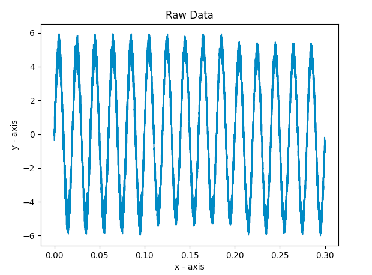
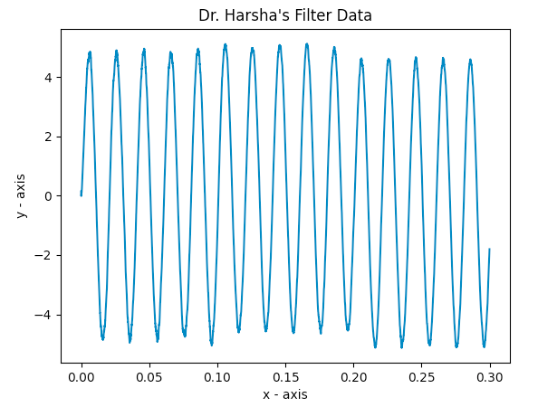
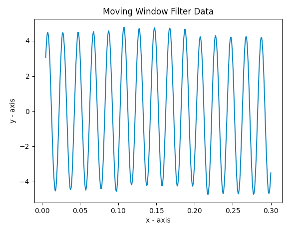

# Software based data pre-processing
#### Composed by: W.R.A.H. Kaushan(170299L) - Department of Electrical Engineering, University of Moratuwa

### Folder Structure
- main.py - main script to run the program
- csv_reader.py - script to read csv files
- plot_data.py - script to plot data
- dr_harsha_filter.py - implementation of Dr. Harsha’s filter
- moving_average_filter.py - implementation of moving average filer

### Raw Data

### Filtered Data - Using Dr. Harsha's Filter

### Filtered Data - Using Moving Window Filter
