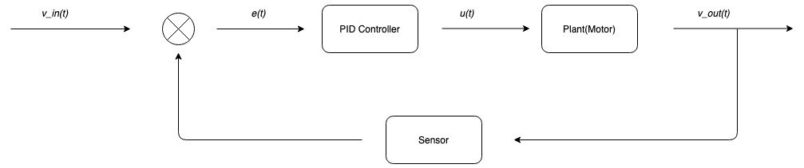
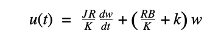
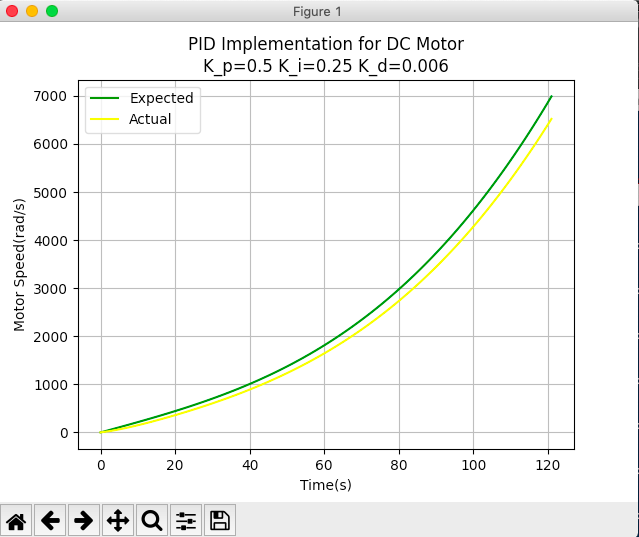
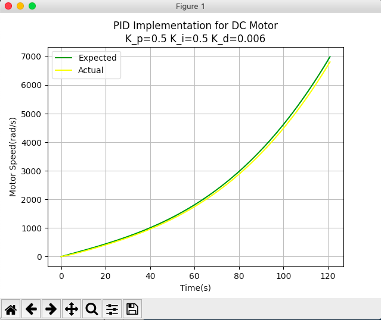

# PID Control Implementation
#### Composed by: W.R.A.H. Kaushan(170299L) - Department of Electrical Engineering, University of Moratuwa

### PID Control Block Diagram

### Chracteristic Equation - DC Motor

- J - inertia
- R - armature resistance
- K - motor constant
- B - friction coefficient of the motor
- k - feedback coefficient

### Folder Structure
- main.py - main script to run the program
- reference.py - time varying reference function generator
- plot_data.py - script to plot data
- pid.py - implementation of PID controller
- sample_generator.py - sample value generator

### Plots

